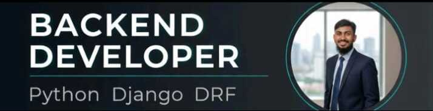

<!-- Header Banner -->
<div align="center">




<br/>

[](https://linkedin.com/in/rakibulislam93)
[](https://leetcode.com/u/rakibulislamarif793/)
[](https://codeforces.com/profile/rakib_007)
[](mailto:rakibulislamarif793@gmail.com)

</div>

---

## ⚡ About Me

```python
class RakibulIslam:
    role       = "Backend Developer"
    education  = "Diploma in Computer Science & Technology (CST)"
    location   = "Dhaka, Bangladesh"
    company    = "JagoBd It solutions | Junior Backend developer"

    current_work = "GEN-HR — Enterprise HR Management SaaS"
    learning     = ["Artificial Intelligence", "Machine Learning"]
    interests    = ["System Design", "Clean Architecture", "DSA"]

    def say_hi(self):
        print("Thanks for visiting! Let's build something great.")
```

---

## 🏗️ Currently Working On

### GEN-HR · Enterprise HR Management SaaS

> A production-grade, multi-tenant SaaS platform built to manage the complete operations of a corporate office — from workforce to finance.

| Module | Description |
|--------|-------------|
| 👤 **Employee** | Full employee lifecycle — onboarding, profiles, records |
| ⏰ **Attendance** | Daily tracking, reporting, and attendance analytics |
| 🏖️ **Leave** | Multi-tier leave application and approval workflow |
| 💰 **Loan** | Employee loan requests, approvals, and repayment tracking |
| 🔐 **RBAC** | Role-based access control with granular permission layers |
| 🧾 **Accounts** | Corporate accounting and financial operations |

`Django` `Django REST Framework` `PostgreSQL` `Role-based Workflow` `SaaS Architecture`

---

## 🛠️ Tech Stack

<div align="center">

**Backend & Language**


**Database**


**Tools**


**Exploring**


</div>

---

## 📊 GitHub Stats

<div align="center">
  
  
</div>

<div align="center">
  
</div>

---

## 🧩 Problem Solving

Actively solving DSA problems through competitive programming — strengthened through the **CSE Fundamentals with Phitron** course.

**Topics:** `Arrays` `Linked Lists` `Stacks & Queues` `Binary Search` `Trees` `Sorting` `Recursion` `Dynamic Programming`

[](https://leetcode.com/u/rakibulislamarif793/)
[](https://codeforces.com/profile/rakib_007)

---

## 📈 Current Focus

```text
⚙️  GEN-HR SaaS (Production)     ████████████░░░  80%
🤖  AI / ML Fundamentals         ████░░░░░░░░░░░  28%
🧩  DSA & Problem Solving        ███████░░░░░░░░  46%
```

---

<div align="center">

  

  <br/><br/>

  > *"First, solve the problem. Then, write the code."*

</div>
